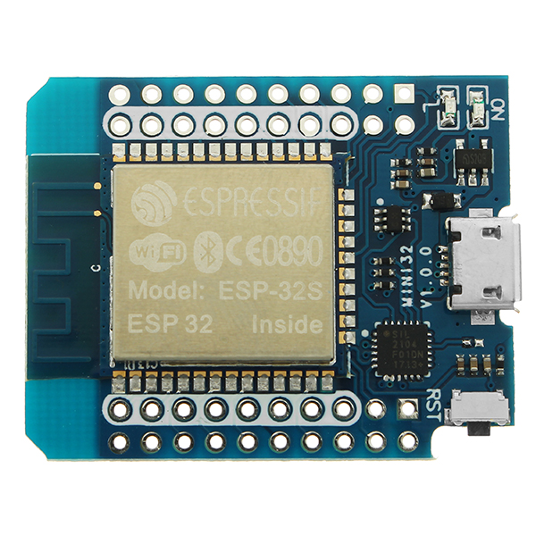

# ESP32 web demo

Running a web server on an ESP32 board

Board I used : Wemos D1 Mini 32

## Compile requirements

- create a `private` directory and copy the  `config/config.h` file on it
- edit `config.h` SSID variables with your wifi informations

